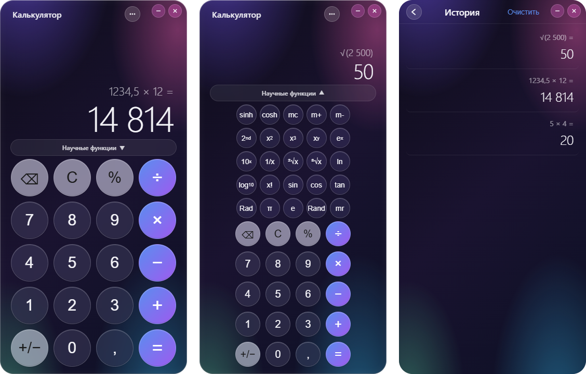
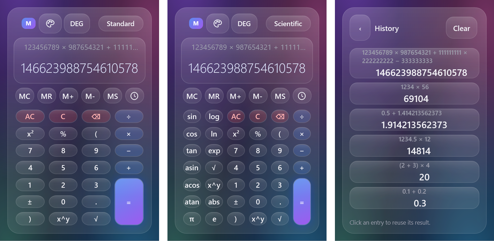

<div align="center">

# Calculators

**Три настольных калькулятора для Windows в стиле Apple Liquid Glass: один на C# и WPF, два на Electron. У каждого свой движок выражений без `eval` и вместе 511 тестов, большая часть — свойства на случайных входах.**

[Скачать для Windows](https://github.com/ALEXalesha/CalculatorPro/releases/latest) &nbsp;·&nbsp; [English version of this file](README.md)

[](https://github.com/ALEXalesha/CalculatorPro/actions/workflows/ci.yml)
[](https://github.com/ALEXalesha/CalculatorPro/releases/latest)
[](LICENSE)

</div>

В каждом релизе у всех трёх есть portable-версия (один `.exe` без установки) и установщик.

| Папка | Приложение | Стек | Что умеет |
|---|---|---|---|
| [`calcpro-wpf/`](calcpro-wpf/README.ru.md) | **Calc Pro** | C# 12, WPF, .NET 8 | Выражения с приоритетами на `decimal` (0.1 + 0.2 = 0.3 точно), скобки, научные функции, память, история, undo/redo |
| [`calcpro-glass/`](calcpro-glass/README.ru.md) | **Calc Pro Glass** | Electron, HTML/CSS/JS | Режимы Standard / Scientific / Fraction (ввод дробей «в столбик»), DEG/RAD/GRAD, 2nd, память, история |
| [`ios-calculator/`](ios-calculator/README.ru.md) | **Calculator iOS 26** | Electron, HTML/CSS/JS | Копия калькулятора iPhone: пошаговое вычисление, научная панель, история |




## Темы

У всех трёх те же пять тем, что в Paint Pro, с теми же цветами: «Стеклянная» (по умолчанию), «Строгая», «Светлая», «Ночная» и «Тёплая». Калькуляторы и Paint задумывались в одном оформлении, теперь так и есть. Тема выбирается кнопкой-палитрой (Calc Pro, Calc Pro Glass) или в меню `•••` (Calculator iOS 26), окно перекрашивается сразу, выбор запоминается до следующего запуска.


## Маленькое окно

Все три сжимаются не хуже встроенного калькулятора Windows, у которого минимум 320×500: Calc Pro до 320×500, Calc Pro Glass и Calculator iOS 26 до 280×500. В низком окне первыми ужимаются табло и отступы, и клавиши научного режима всё равно помещаются. В узком Calc Pro история открывается вместо клавиатуры, как в калькуляторе Windows, с кнопкой «назад» в заголовке; когда окно снова широкое, она возвращается в свою колонку. Длинный результат на табло уменьшается, а не теряет цифры под «…», а длинный пример в истории переносится.



## Быстрый старт

Нужны .NET SDK 8+, Node.js 20+ и Inno Setup 6 (для установщика Calc Pro).

```powershell
.\build.ps1                 # тесты + portable + setup для всех трёх → .\dist
.\build.ps1 -Only glass     # только одно приложение: wpf | glass | ios
.\build.ps1 -SkipTests      # только упаковка
```

Результат в `dist/`:

```
CalcPro-1.4.0-Portable.exe          CalcPro-1.4.0-Setup.exe
CalcProGlass-1.4.0-Portable.exe     CalcProGlass-1.4.0-Setup.exe
CalculatorIOS26-1.4.0-Portable.exe  CalculatorIOS26-1.4.0-Setup.exe
```

Запуск из исходников:

```powershell
dotnet run --project calcpro-wpf\src\CalcPro.Wpf
cd calcpro-glass;  npm ci; npm start
cd ios-calculator; npm ci; npm start
```

## Тесты

```powershell
dotnet test calcpro-wpf\CalcPro.sln          # 322 теста (xUnit + FsCheck)
cd calcpro-glass;  npm test; npm run test:e2e # 131 unit + e2e в Electron
cd ios-calculator; npm test; npm run test:e2e # 58 unit + e2e в Electron
```

Основа — property-based тесты: генератор выдаёт тысячи случайных выражений и
последовательностей нажатий, а тест проверяет законы и инварианты. Подробно в
[docs/TESTING.md](docs/TESTING.md).

Свойства продолжают находить настоящие баги. При подготовке к публикации свойство со
случайными нажатиями в Calc Pro Glass нашло, что `EE` сразу после `=` приклеивал `E`
к устаревшему экрану (`0E`), а следующая цифра всё стирала. Кадры для README нашли ещё
два в Calc Pro: строка выражения показывала `*` и `/`, хотя на кнопках `×` и `÷`, а
значок памяти растягивался в высокую полоску.

Проверки тем читают сами файлы тем: у всех пяти один набор ключей, текст на своих клавишах в любой теме не бледнее 4.5:1, а к цветам темы разметка обращается только через тему. Они нашли, что у клавиш AC, ± и % в двух темах контраст ниже нормы: 3.37:1 в «Стеклянной» и 2.60:1 в «Строгой». Исправлено до выпуска.

Проверки маленького окна: `WindowLayoutTests` держат само правило (минимум, пороги, закрытие истории при сужении и возврат при расширении - свойством FsCheck на случайных последовательностях ширин), а программа кадров открывает настоящее окно 320×500 и падает, если видимая кнопка вышла за окно, меньше 20 px или не влезает в свою ячейку сетки, или если строка истории либо табло обрезана. Эта проверка до выпуска нашла две ошибки: у AC, C, ⌫, операций и научных клавиш свой стиль с минимальной высотой 42, и в низком окне ряды срезали их наполовину, а табло показывало `14662398875…` вместо 146623988754610578. e2e обоих Electron-калькуляторов сжимают окно до 280×500 и проверяют каждую клавишу в каждом режиме и длинный пример в истории.

CI на каждый пуш гоняет тесты движков на C# и JavaScript. e2e требуют настоящего окна
Electron и запускаются локально перед выпуском.

## Кадры собирает программа

Ни один снимок здесь не снят с экрана. `calcpro-wpf/tools/CalcPro.Screenshots`
открывает настоящее `MainWindow` далеко за краем экрана, нажимает кнопки через команды
ViewModel и рисует окно само через `RenderTargetBitmap`. У обоих Electron-приложений
`tools/make-screenshots.js`: настоящая страница в скрытом окне с сессией в памяти,
настоящие клики и `capturePage()`. Чужое окно в кадр попасть не может.

## Структура

```
calculators/
├── build.ps1              сборка всего в dist/
├── docs/TESTING.md        что и как проверяют тесты
├── CHANGELOG.md
├── calcpro-wpf/           Calc Pro (WPF)
│   ├── src/CalcPro.Core/  движок без UI: токенизатор, Pratt-парсер, decimal-вычислитель, команды с undo
│   ├── src/CalcPro.Wpf/   окно, MVVM, стили
│   ├── tests/             xUnit + FsCheck
│   ├── tools/             генератор кадров для README
│   └── installer/         Inno Setup
├── calcpro-glass/         Calc Pro Glass (Electron)
│   ├── src/calc-core.js   движок без DOM
│   ├── src/app.js         отрисовка и события
│   ├── test/  e2e/  tools/
└── ios-calculator/        Calculator iOS 26 (Electron)
    ├── src/calc-engine.js движок без DOM
    ├── src/app.js
    ├── test/  e2e/  tools/
```

В репозитории только исходники. `bin/`, `obj/`, `node_modules/` и `dist/` игнорируются.

## Лицензия

MIT, см. [LICENSE](LICENSE).
