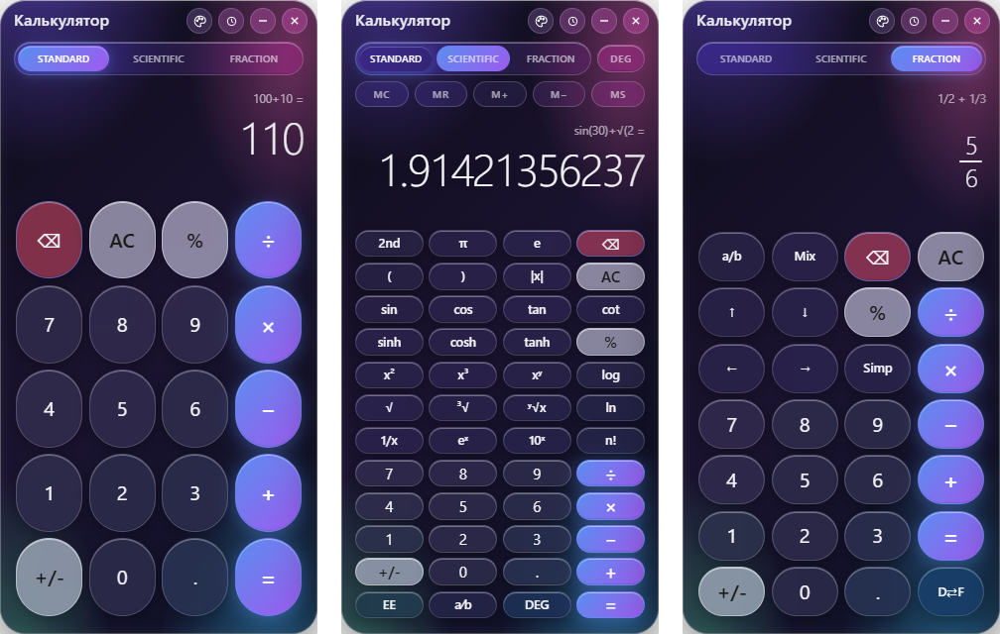
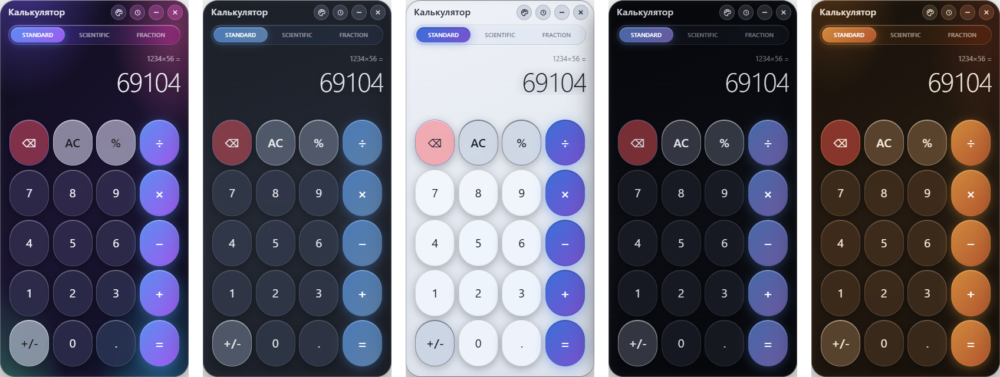

<div align="center">

# Calc Pro Glass

**A calculator in the Apple Liquid Glass style with three modes: standard, scientific, and stacked fractions. The parser uses no `eval`, and the engine is checked with fast-check properties.**

[Download for Windows](https://github.com/ALEXalesha/CalculatorPro/releases/latest) &nbsp;·&nbsp; [Русская версия этого файла](README.ru.md) &nbsp;·&nbsp; [All three calculators](../README.md)

[](https://github.com/ALEXalesha/CalculatorPro/actions/workflows/ci.yml)
[](https://github.com/ALEXalesha/CalculatorPro/releases/latest)
[](LICENSE)



</div>

## Three modes

- **Standard**: expressions with operator precedence, and percent the way Apple and Windows calculators do it: `100 + 10 %` = 110, `100 × 10 %` = 10.
- **Scientific**: trigonometry with inverse and hyperbolic functions, `ln log eˣ 10ˣ`, roots `√ ³√ ʸ√x`, powers, `n!`, `1/x`, `|x|`, `π e`, `EE`, DEG/RAD/GRAD, 2nd, memory.
- **Fraction**: fractions typed "in a column" with a cursor (`a/b`, arrows, `Mix`, `Simp`), result as a fraction or a decimal (`D⇄F`).
- **Programmer**: 64-bit signed integers typed in HEX, DEC, OCT or BIN and shown in all four at once; `+ − × ÷ Mod`, `AND OR XOR NOT`, `<< >>`, brackets. The same logic and the same 52 shared examples as Calc Pro. Keyboard: `0-9 a-f`, `& | ^ ~ < >`, `%` for Mod.

History (50 entries) and memory are kept in localStorage.

## Themes

The five themes of Paint Pro, with its colours: pick one from the palette button next to History. The choice is remembered.



## Small window

The window shrinks to 280×500, below the 320×500 of the calculator built into Windows. In a low window the display and the gaps get smaller, so the twelve rows of the scientific mode stay at 23 px instead of 18; a long example in the history wraps after its operators instead of ending in `…`. The end-to-end run resizes the window to 280×500 and checks every key of every mode.

## The window remembers itself

The window opens where and how large it was closed (`window-state.json` in the app's data folder). `window-state.js` holds the rule and is the same file in Calculator iOS 26: a window on an unplugged monitor is centred, one larger than the screen is cut to it, the title bar always stays on a screen.

## The engine

`src/calc-core.js` has no DOM and is shared by the page and the Node tests. The parser is shunting-yard with no `eval`. The grammar: `+ -` < `* /` < unary minus < `^` (right-associative), so `-2^2` is -4 and `2^-2` is 0.25. Implicit multiplication works: `2(3)`, `(1)(2)`, `2π`, `2sin(30)`. Unclosed brackets close on `=`.

## Tests

```powershell
npm ci
npm test            # 213 unit and property tests (node:test + fast-check)
npm run test:e2e    # the real page in Electron: clicks, checks, no console errors
```

The parser properties build random expression trees and run 2000 cases each. The key-press state machine is tested separately from the parser, and the end-to-end run clicks through all three modes in a hidden Electron window with the app's own preload and Content-Security-Policy.

## Screenshots are generated

`tools/make-screenshots.js` opens the real page in a hidden window the size of the app, in a separate in-memory session so nobody's history gets into the frame, presses buttons by clicking them like the e2e test, and captures the page itself with `capturePage()`.

```powershell
npx electron tools/make-screenshots.js
```

The first version captured every frame one key press late: a hidden Electron window repaints lazily. `backgroundThrottling: false` and waiting for two animation frames fixed that.

The fraction frame then found a bug in the program itself: the line above the result and the history entry showed `1/2 + 1/3` as `12 + 13`. The text was made by stripping tags from the stacked fraction, which dropped the bar. It is now built from the fractions themselves, and a fast-check property requires exactly one bar per fraction.

## Running and building

```powershell
npm ci
npm start
npm run dist        # portable exe and NSIS installer into dist\
```

Keyboard: `0-9 . ,` · `+ - * / ^ ( ) %` · `Enter` = · `Backspace` ⌫ · `Esc`/`Delete` AC · `Ctrl+H` history · `F1` Standard ↔ Scientific; in fraction mode the arrows move the cursor and `/` opens a fraction.

`contextIsolation`, `sandbox`, no `nodeIntegration`; the Content-Security-Policy allows no scripts except the app's own files.

## Stack

Electron · vanilla JavaScript · node:test · fast-check · electron-builder

## Licence

MIT, see [LICENSE](LICENSE).
