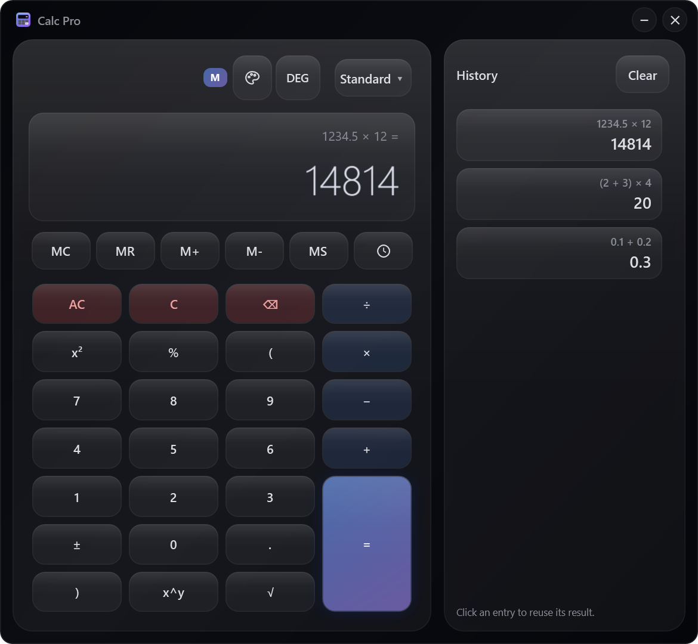
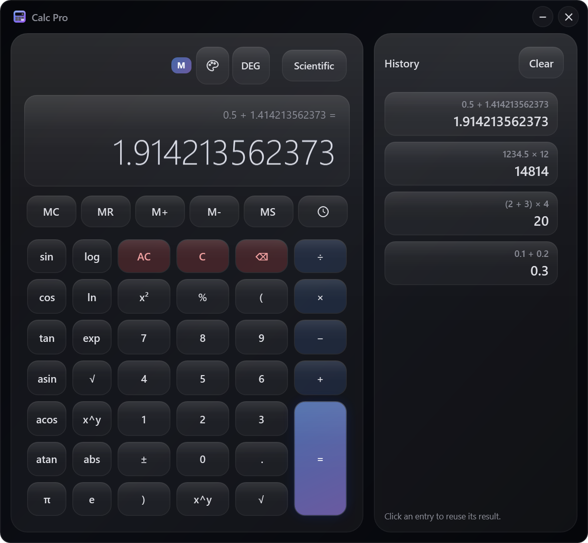

# Calc Pro (WPF)

[Download for Windows](https://github.com/ALEXalesha/CalculatorPro/releases/latest) &nbsp;·&nbsp; [Русская версия этого файла](README.ru.md) &nbsp;·&nbsp; [All three calculators](../README.md)

 

A Windows calculator in the Apple Liquid Glass style. C# 12 and WPF on .NET 8, MVVM.

## Inside

- **Its own expression engine.** Tokenizer → Pratt parser → AST → evaluator. No `eval`, no `DataTable.Compute`.
- **Exact arithmetic.** `decimal` everywhere, rounded to 12 places (`MidpointRounding.ToEven`); `0.1 + 0.2 == 0.3` literally. Only `sin/cos/log/exp` go through `double`.
- **Undo/redo through the Command pattern.** Every key press is an `ICalcCommand` with `Execute` and `Undo`.
- **An explicit input state machine** (`CalcPhase`) with invariants the tests check after every press.
- **MVVM.** The view only binds to the view model; the code-behind has nothing but animations.

The engine, `CalcPro.Core`, targets plain `net8.0` and does not reference WPF, so its tests run on Linux in CI.

## Running and building

```powershell
dotnet run --project src\CalcPro.Wpf
dotnet test CalcPro.sln                  # 298 tests
..\build.ps1 -Only wpf                   # portable .exe and installer into ..\dist
dotnet run --project tools\CalcPro.Screenshots   # the README frames
```

The portable build is a self-contained single file (about 50 MB compressed); no .NET is needed on the target machine. The installer is Inno Setup (`installer\CalcPro.iss`) and installs for the current user without administrator rights.

## Grammar

| Token | Precedence | Notes |
|---|---|---|
| `+` `-` | 70 | left-associative |
| `*` `/` | 80 | left-associative |
| unary `-` `+` | 90 | prefix |
| `^` | 100 | **right**-associative: `2^3^2 = 512` |
| `!` `%` | 110 | postfix: `2^3! = 64`, `-3! = -6`, `50% = 0.5` |
| `(` | 120 | grouping, function call |

Functions: `sin cos tan asin acos atan log ln exp sqrt abs sqr inv`; constants `pi`, `e`. Limits: nesting ≤ 256, length ≤ 1000 tokens.

## Input state machine

| Phase | Expression ends with | Next digit |
|---|---|---|
| `Idle` | (empty) | starts a number |
| `EnteringDigit` | operator, `(` or empty | is appended |
| `AfterOperator` | operator or `(` | starts a number |
| `AfterValue` | `)` or `%` | implicit multiplication: `(2+3) 4` = 20 |
| `AfterEquals` | `" ="` | new expression |

`=` drops a dangling operator and closes open brackets. A function after `)` applies to the group: `(9 + 7) √` → `sqrt(9 + 7)`.

## Tests

xUnit and FsCheck. A random expression tree printed with minimal brackets parses back into the same tree, which pins the whole precedence table at once. The evaluator is checked against algebraic laws (commutativity, distributivity, `sin² + cos² = 1`, `ln(exp x) = x` and more), and any random tree, including numbers at the edge of `decimal`, may only end in a `CalcEvalException`: that is what caught the overflows that used to crash the app. 3000 random sequences of 40 key presses check the state machine after every press, and undoing all of them must return the initial state. Details in [../docs/TESTING.md](../docs/TESTING.md).

## Screenshots are generated

`tools/CalcPro.Screenshots` creates the real `App` resources and `MainWindow` far off screen, presses keys through the same view-model commands the buttons are bound to, and renders the window's client area with `RenderTargetBitmap`. The first frames found two bugs in the window: the expression line and the history showed `*` and `/` while the buttons say `×` and `÷`, and the memory badge stretched to the full height of its row. The engine keeps ASCII operators; `DisplayFormat.Pretty` swaps them for the screen, and an FsCheck property makes sure the pretty text tokenizes exactly like the original.

## Keyboard

| Key | Action |
|---|---|
| `0`–`9`, `.`, `,` | digits |
| `+` `-` `*` `/` | operators |
| `Enter` | evaluate |
| `Backspace` / `Delete` / `Esc` | delete a character / C / AC |
| `Ctrl+Z` / `Ctrl+Y` | undo / redo |
| `Ctrl+C` / `Ctrl+V` | copy the result / paste a number |
| `Ctrl+H` | history panel |
| `Ctrl+M` | memory recall |
