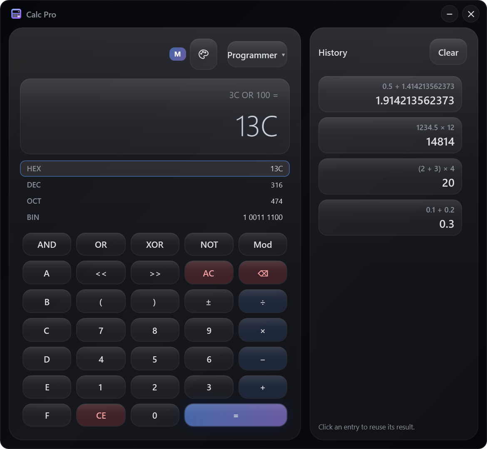
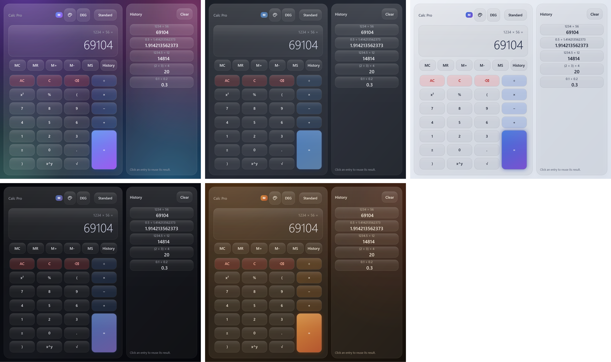

# Calc Pro (WPF)

[Скачать для Windows](https://github.com/ALEXalesha/CalculatorPro/releases/latest) &nbsp;·&nbsp; [English version of this file](README.md) &nbsp;·&nbsp; [Все три калькулятора](../README.ru.md)

 

Windows-калькулятор в стиле Apple Liquid Glass. C# 12 + WPF на .NET 8, MVVM.

## Что внутри

- **Своё ядро вычислений.** Tokenizer → Pratt-парсер → AST → Evaluator. Никакого
  `eval` и `DataTable.Compute`.
- **Точные вычисления.** `decimal` везде, округление до 12 знаков (`MidpointRounding.ToEven`).
  `0.1 + 0.2 == 0.3` буквально. В `double` уходят только `sin/cos/log/exp`.
- **Command Pattern для undo/redo.** Каждое нажатие — объект `ICalcCommand` с `Execute`/`Undo`.
- **Явный автомат состояний** `CalcPhase` с проверяемыми инвариантами (см. ниже).
- **MVVM.** View только привязывается к ViewModel; в code-behind лишь анимации и меню тем.
- **Режим «Программист»** (меню режимов: Standard, Scientific, Programmer). Целые 64 бита
  со знаком: HEX, DEC, OCT, BIN одновременно, `+ − × ÷ Mod`, `AND OR XOR NOT`, `<< >>`,
  скобки; клавиши A-F с клавиатуры. Ядро `ProgrammerCalculator` и его 52 примера общие с
  Calc Pro Glass (`test-vectors/programmer.json`).



## Запуск и сборка

```powershell
dotnet run --project src\CalcPro.Wpf
dotnet test CalcPro.sln
..\build.ps1 -Only wpf        # portable .exe + установщик в ..\dist
```

Portable — self-contained single-file (~50 МБ со сжатием), .NET на целевой машине не нужен.
Установщик — Inno Setup (`installer\CalcPro.iss`); по умолчанию ставится для текущего
пользователя, без прав администратора.

## Структура

```
CalcPro.sln
├── src/CalcPro.Core/          движок, без WPF (net8.0)
│   ├── Models/                CalcState, CalcPhase, CalcMode, AngleMode, HistoryEntry
│   ├── Services/              Tokenizer, Parser, Ast, Evaluator, DisplayFormat, HistoryManager
│   └── Commands/              Digit, Operator (+ постфиксный %), Paren, Equals, Clear/ClearEntry,
│                              Backspace, Sign, Function, Constant, EnterValue, Memory
├── src/CalcPro.Wpf/           App, MainWindow, CalcViewModel, стили, иконка
├── tests/CalcPro.Tests/       xUnit + FsCheck (409 тестов)
└── installer/CalcPro.iss
```

## Темы

Пять тем Paint Pro - такие же словари ресурсов (`Resources/Themes/*.xaml`) с теми же цветами. Список открывает кнопка-палитра в заголовке, окно перекрашивается сразу, выбор хранится в `%APPDATA%\CalcPro\theme.txt`. `ThemeFileTests` читает словари как XML: у всех пяти одни ключи, текст на кнопках читается в любой теме, и нигде в разметке нет `StaticResource` к ключу темы.



## Маленькое окно

Окно сжимается до 320×500 - это минимум встроенного калькулятора Windows. Правило лежит в `WindowLayout` (CalcPro.Core), `MainWindow.ApplyLayout` его выполняет: уже 720 пикселей история открывается вместо клавиатуры, с кнопкой «назад» в заголовке (открытая колонка истории при сужении закрывается, а при расширении возвращается); уже 420 название уступает место кнопкам; ниже 640 табло, шапка и отступы становятся меньше. Длинный результат на табло уменьшается в `Viewbox`, а не обрезается «…», строки истории переносятся.


## Окно

Окно открывается там и такого размера, где его закрыли (`%APPDATA%\CalcPro\window.txt`). Куда ему можно, решает `WindowPlacement` в CalcPro.Core: окно на отключённом мониторе встаёт по центру, больше экрана - ужимается, заголовок всегда остаётся на экране. `WindowPlacementService` узнаёт рабочие области всех мониторов и пишет файл через временный.

Заголовок окна свой (`WindowChrome`, прозрачное окно): название, круглые кнопки «свернуть» и «закрыть» в цветах темы, углы скруглены на 14 px. Развёрнутое окно получает рабочую область своего монитора через `WM_GETMINMAXINFO` и не закрывает панель задач.

## Грамматика

| Токен | Приоритет | Замечания |
|---|---|---|
| `+` `-` | 70 | левая ассоциативность |
| `*` `/` | 80 | левая ассоциативность |
| унарный `-` `+` | 90 | префикс |
| `^` | 100 | **правая** ассоциативность: `2^3^2 = 512` |
| `!` `%` | 110 | постфикс: `2^3! = 64`, `-3! = -6`, `50% = 0.5` |
| `(` | 120 | группировка, вызов функции |

Функции: `sin cos tan asin acos atan log ln exp sqrt abs sqr inv`; константы `pi`, `e`.
Ограничения: вложенность ≤ 256, длина ≤ 1000 токенов.

## Автомат ввода

| Фаза | Выражение заканчивается на | Следующая цифра |
|---|---|---|
| `Idle` | (пусто) | начинает число |
| `EnteringDigit` | оператор, `(` или пусто | дописывается |
| `AfterOperator` | оператор или `(` | начинает число |
| `AfterValue` | `)` или `%` | неявное умножение: `(2+3) 4` = 20 |
| `AfterEquals` | `" ="` | новое выражение |

`=` отбрасывает висящий оператор и закрывает незакрытые скобки. Функция после `)`
применяется к группе: `(9 + 7) √` → `sqrt(9 + 7)`.

## Хоткеи

| Клавиша | Действие |
|---|---|
| `0`–`9`, `.`, `,` | цифры |
| `+` `-` `*` `/` | операции |
| `Enter` | вычислить |
| `Backspace` / `Delete` / `Esc` | стереть символ / C / AC |
| `Ctrl+Z` / `Ctrl+Y` | undo / redo |
| `Ctrl+C` / `Ctrl+V` | копировать результат / вставить число |
| `Ctrl+H` | панель истории |
| `Ctrl+M` | Memory Recall |
