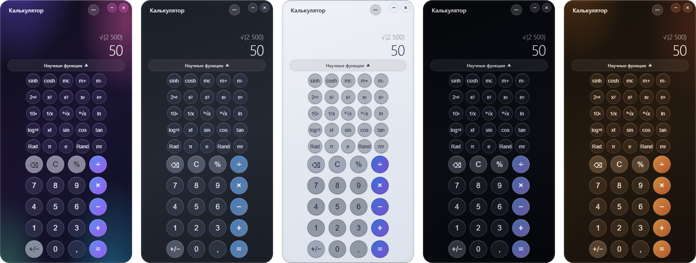

# Calculator iOS 26 (Electron)

[Скачать для Windows](https://github.com/ALEXalesha/CalculatorPro/releases/latest) &nbsp;·&nbsp; [English version of this file](README.md) &nbsp;·&nbsp; [Все три калькулятора](../README.ru.md)


Копия приложения «Калькулятор» из iOS 26 в стиле Liquid Glass: цветной фон под
стеклом, круглые кнопки, которые остаются круглыми при любом размере окна.

## Поведение («два поля», как на iPhone)

- Белое поле снизу (`currentExpr`) растёт по мере ввода: `2`, `2 + `, `2 + 3`.
- Серое поле сверху (`lastExpression`) заполняется при `=` или цепочке операций.
- Вычисление пошаговое, без приоритетов: `2 + 3 × 4 =` → 20 (после `×` показывается `5 × `).
- `C` сначала сбрасывает текущее число, повторное нажатие (`AC`) — всё.
- `100 + 20 %` → 120; `±` после оператора начинает отрицательное число.
- Числа по-русски: пробел между тысячами, запятая: `1 234,56`.
- Научная панель (меню `•••` или плашка «Научные функции»): `sinh cosh`, память,
  `2nd`, степени, корни, `ln log₁₀ x!`, тригонометрия, `Rad`, `π e Rand`.
- История: 200 записей, клик по записи продолжает вычисление с её результатом.

## Темы

Пять тем Paint Pro в меню `•••`, раздел «Тема»; выбор запоминается. Клавиши операций берут акцент темы вместо оранжевого iPhone, как кнопки Paint.



## Запуск и сборка

```powershell
npm ci
npm start              # запуск (F12 — DevTools, только из исходников)
npm test               # 78 unit- и property-тестов
npm run test:e2e       # e2e в настоящем Electron
..\build.ps1 -Only ios     # portable + NSIS-установщик в ..\dist
```

## Устройство

```
main.js            окно 320×640 (минимум 280×500), frameless, transparent; IPC свернуть/закрыть;
                   открывается там, где его закрыли (window-state.js, тот же файл, что у Calc Pro Glass)
preload.js         contextBridge → window.windowAPI
src/index.html     разметка и CSS
src/calc-engine.js движок без DOM (UMD)
src/app.js         раскладка кнопок (fit), отрисовка, клики, клавиатура, история
assets/            icon.ico, icon.png, icon.svg (исходник)
test/engine.test.js
e2e/smoke.js
```

Размер кнопок считает `fit()` в `app.js`: столбцы всегда на всю ширину, а ряд - меньшее
из размера по ширине и по высоте, поэтому клавиши круглые, когда хватает высоты, и
капсулы, когда не хватает, как на iPhone в альбомной ориентации. В низком окне (минимум
280×500, меньше, чем 320×500 у калькулятора Windows) первым ужимается табло. Длинные
числа в истории переносятся, а не уезжают за край.

## Хоткеи

`0–9 . ,` · `+ - * /` · `Enter` = · `Backspace` · `Esc` AC · `%` · `Esc` закрывает историю.

## Безопасность

Раньше страница работала с `nodeIntegration: true` и `contextIsolation: false`, то есть
имела полный доступ к Node.js. Теперь `contextIsolation`, `sandbox` и CSP, а связь с окном
идёт только через `preload.js`.
